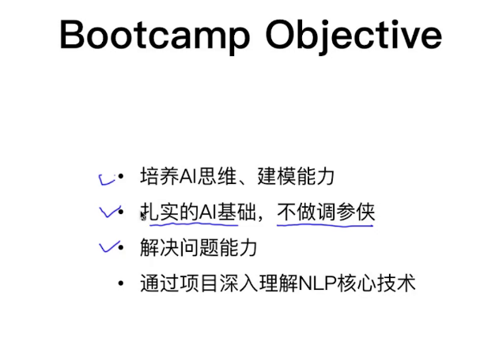
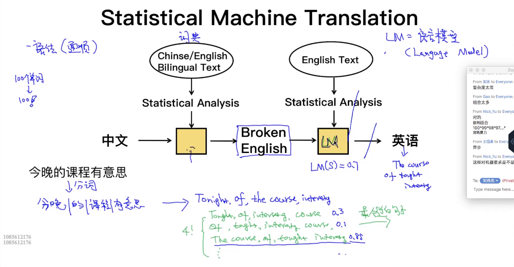
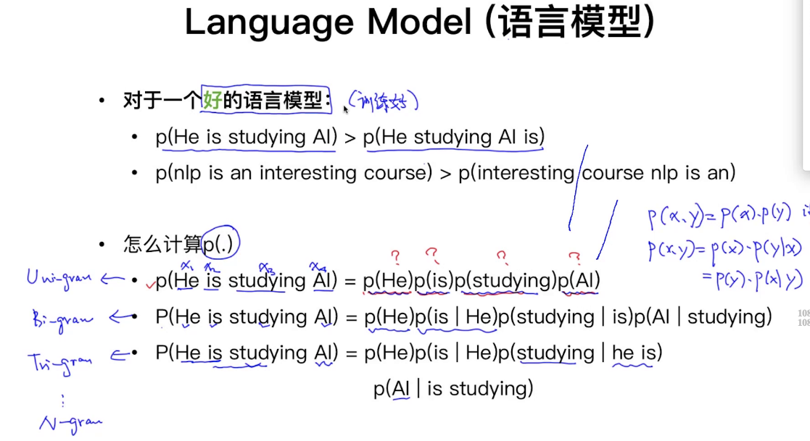
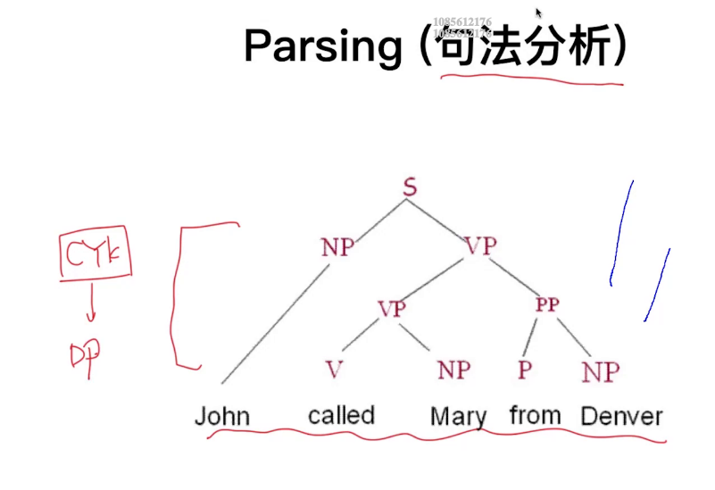

## requirements:

## Bootcamp Objective

## How to succeed in Bootcamp

## What is NLP?

## Why NLP is harder than CV (Computer Vision)?
* ambiguity:
    solving it by learning from data

## Machine Translation
### Statistical Machine Translation

The factory of n is too large, so in reality we can't do things like this.

We will use another model to combine these two steps.

LM: language model, to get meaningful sentence with broken words.

TM: Translation model

Decoding Algorithm
Viterbi Algorithm (DP)

Statistical MT: Three Problems

Bayes Theorem

## Language Model

* uni-gram
* bi-gram
* tri-gram
* ...
* n-gram

## NLP use case
* Question Answering
* Sentiment Analysis
* Machine Translation
* Text Summarization (very hard)
* Chatbot
* Information Extraction (very hard)

### chatbot

sequence2sequence

意图识别

## Technology

* word segmentation
* part-of-speech
* named entity recognition
* parsing (句法分析)
* Dependency parsing
* relation extraction

