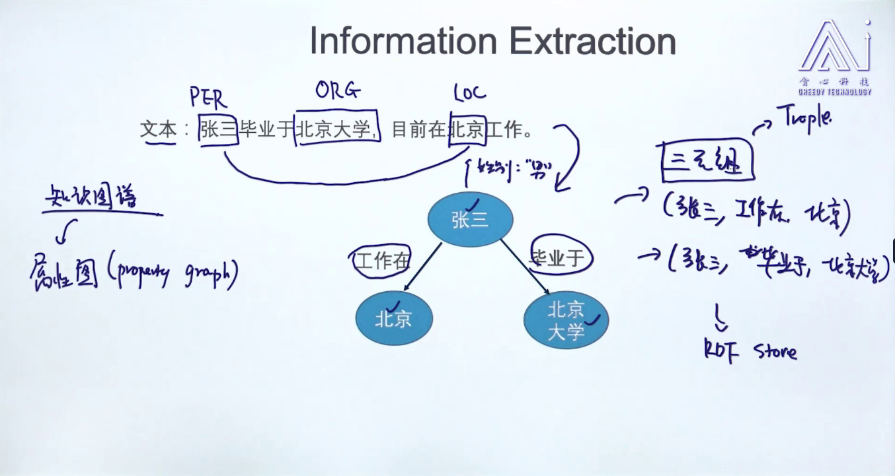
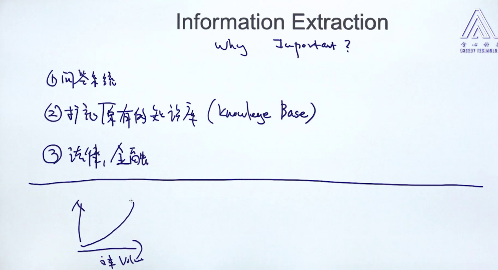
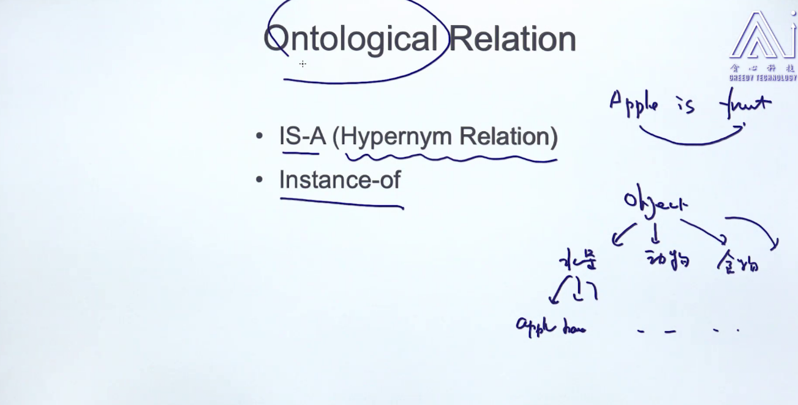
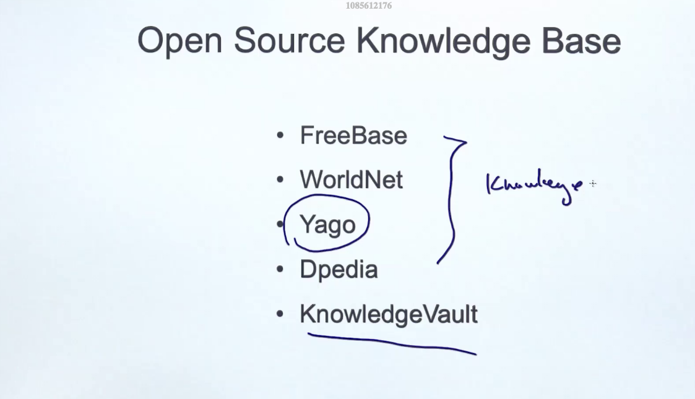

# Information Extraction

三元组     
NER: named-entity recognition   
知识库：knowledge base  
强人工智能   
问答系统：question answering system  
知识图谱    
bag-of-words feature   
pos feature     
syntax parse    
dependency parse    
entity  
位置相关信息  

---------------------

# Ontological Relation
## is-a (hypernym relation)
## instance-of
is-a is similar with instance-of    

## Relation extraction method
给予规则，最主流    
bootstrap and distant supervision is semi-supervised    
无监督还停留在学术界，工业界还是需要人工标记      

rule-based method   

supervised method   

feature engineering is very important, we need to define entity set and relation set, and mark them.

feature engineering

