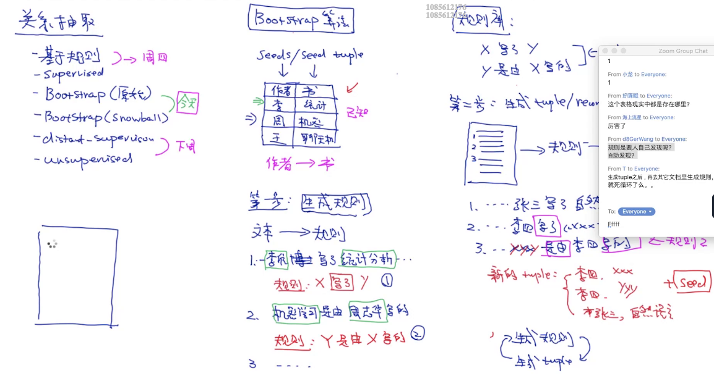
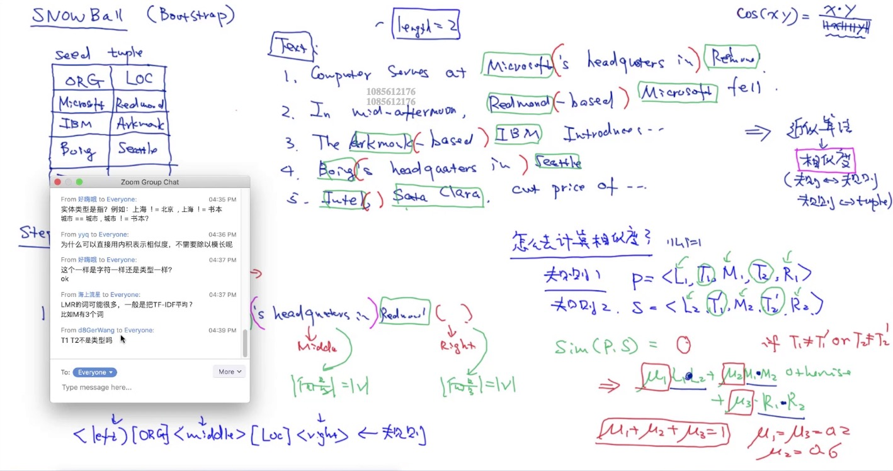
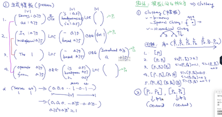

# pre-requisite
* 内积 （dot product, 得到一个值）和外积 （cross product, 得到一个新的向量）
* dot product get similarity

# Relation Extraction Impl

## bootstrap algorithm
seed tuple    
rule database     
互相影响

relation (3 元组)

## Snow Ball (bootstrap)
5元组

confidence
